# Multi-Department VLAN Segmentation with RSTP and Inter-VLAN Routing

## Overview

This project implements a 5-department switched network built around a central multilayer switch, with each department isolated on its own VLAN and full inter-VLAN routing enabled via Switched Virtual Interfaces (SVIs). The topology demonstrates a hub-and-spoke (star) hierarchical design — a common real-world pattern for connecting multiple departments/floors/buildings back to a central distribution point.

The lab covers VLAN segmentation, 802.1Q trunking, Rapid Spanning Tree Protocol (RSTP) root bridge control, and Layer 3 inter-VLAN routing — verified end-to-end with live ping tests across VLANs.

## Topology

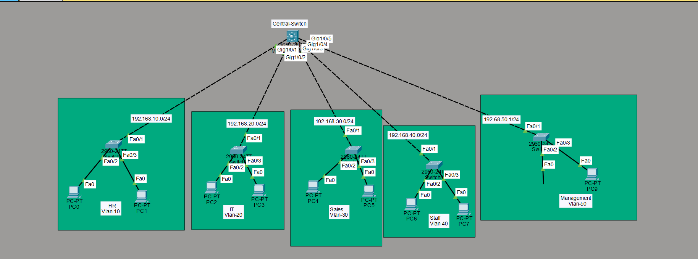

A Cisco 3650 Multilayer Switch (**Central-SW**) connects to five Cisco 2960 access switches, one per department, each hosting two PCs:

| Switch | Department | VLAN | Subnet |
|---|---|---|---|
| SW-1 | HR | 10 | 192.168.10.0/24 |
| SW-2 | IT | 20 | 192.168.20.0/24 |
| SW-3 | Sales | 30 | 192.168.30.0/24 |
| SW-4 | Staff | 40 | 192.168.40.0/24 |
| SW-5 | Management | 50 | 192.168.50.0/24 |

Each access switch connects to the central switch via a single trunk uplink (Fa0/1 → Gig1/0/x), and hosts two PCs on access ports (Fa0/2, Fa0/3).

## Key Concepts Demonstrated

- **VLAN segmentation** — each department isolated into its own broadcast domain, with only its own VLAN created locally (no unnecessary VLAN sprawl across switches that don't need them)
- **802.1Q trunking** — all switch-to-switch uplinks configured as trunks, carrying tagged VLAN traffic between the access switches and the central switch
- **Rapid Spanning Tree Protocol (RSTP)** — `rapid-pvst` enabled network-wide, with the central switch manually configured as root bridge for every VLAN (`spanning-tree vlan X root primary`), ensuring predictable, centrally-controlled traffic flow
- **Inter-VLAN routing via SVIs** — Switched Virtual Interfaces configured on the central multilayer switch for each VLAN, each acting as the default gateway for its department, with `ip routing` enabled globally to allow full Layer 3 forwarding between subnets

## Configuration Steps

1. Created VLANs 10, 20, 30, 40, 50 on their respective access switches (and all five on the central switch, since it trunks and routes for all of them)
2. Assigned department PC-facing ports to access mode in their VLAN (`switchport mode access`, `switchport access vlan X`)
3. Configured all switch-to-switch uplinks as trunks (`switchport mode trunk`, `switchport trunk allowed vlan X`)
4. Enabled `spanning-tree mode rapid-pvst` on all switches
5. Set the central switch as root bridge for every VLAN (`spanning-tree vlan 10/20/30/40/50 root primary`)
6. Created SVIs on the central switch for each VLAN with the department's gateway IP (e.g., `interface vlan 10` → `ip address 192.168.10.1 255.255.255.0`)
7. Enabled `ip routing` globally on the central switch to activate inter-VLAN forwarding
8. Verified configuration and tested cross-VLAN connectivity

## Verification

### VLAN Configuration
`show vlan brief` confirms each department switch has created only its own VLAN, with the correct name and ports assigned:
- 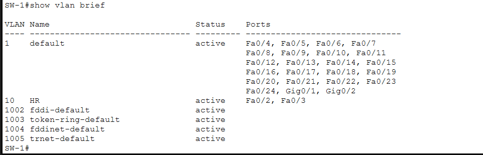
- 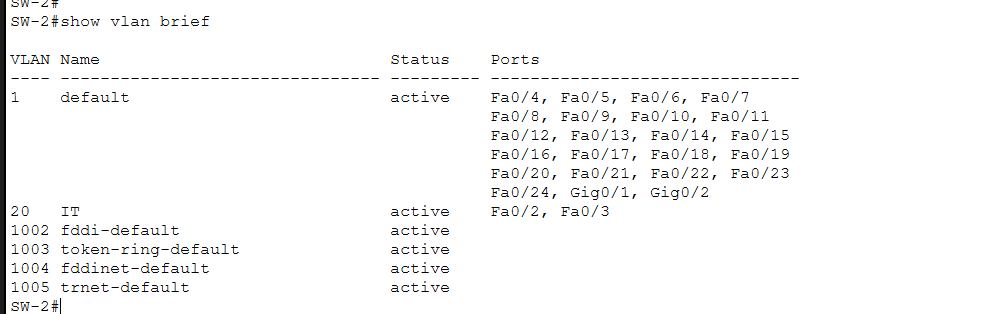
- 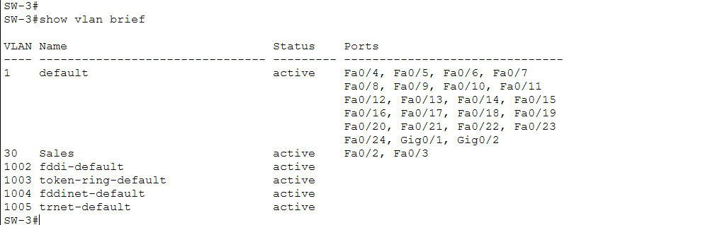
- 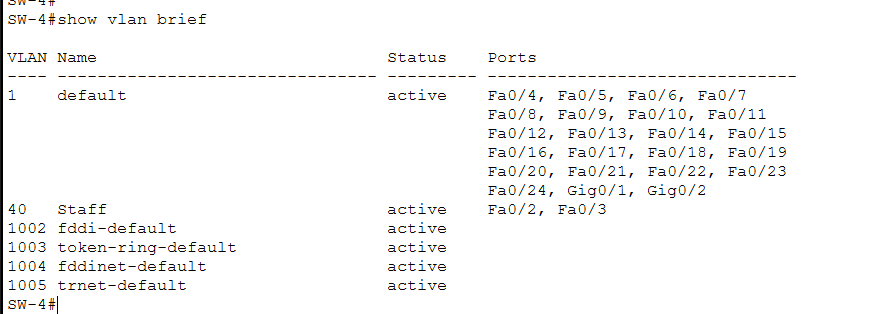
- 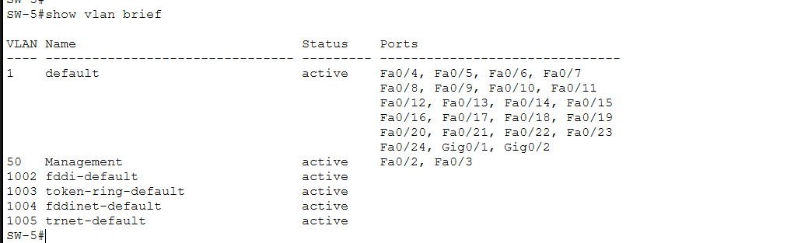

### Trunk Verification
`show interfaces trunk` confirms all uplinks are trunking with 802.1Q encapsulation and consistent native VLAN (1) on both ends:
- 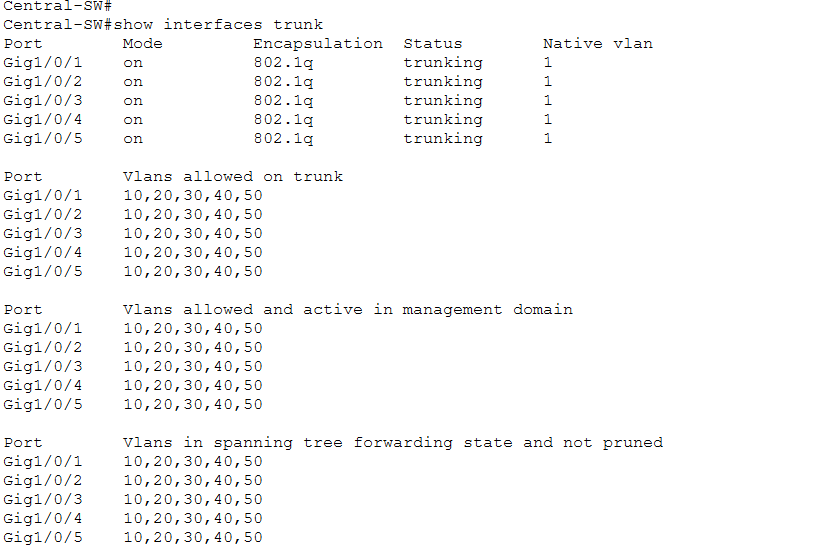
- 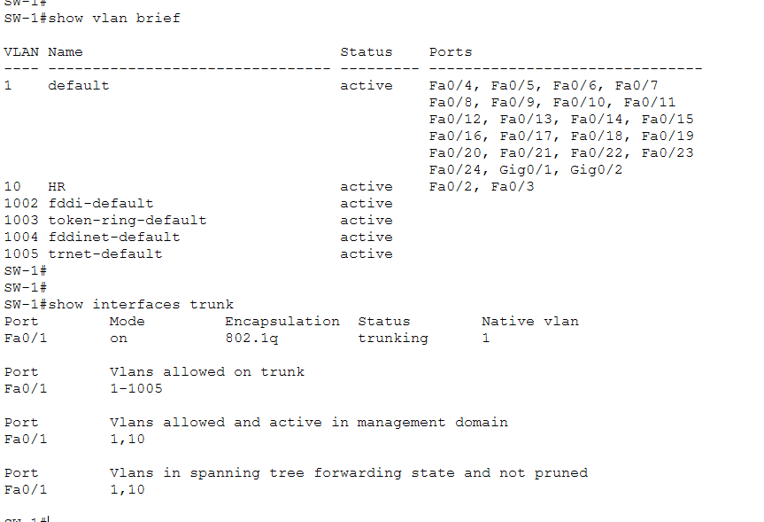
- 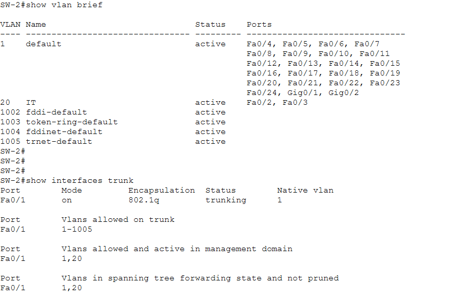
- 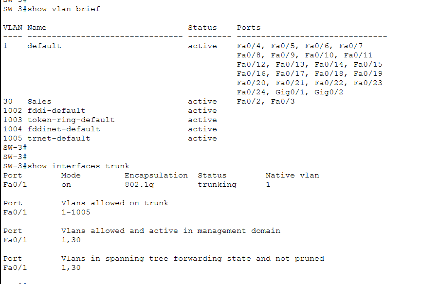
- 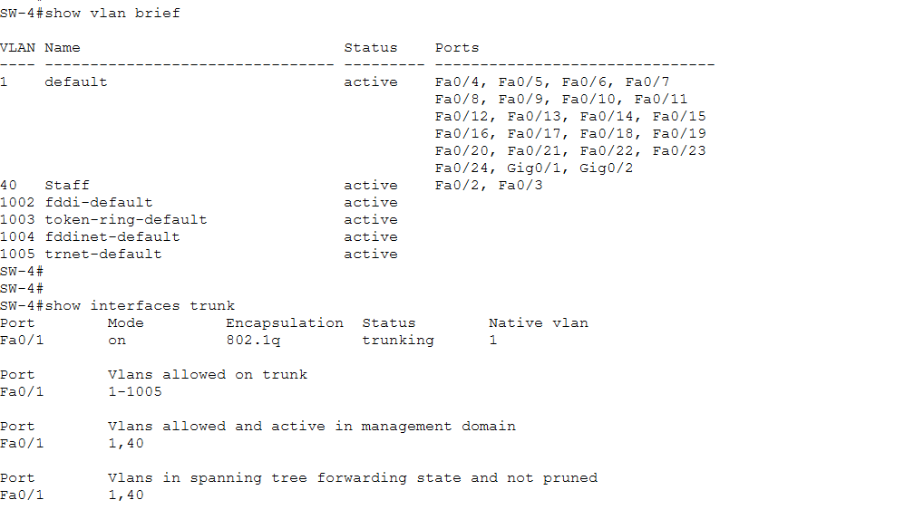
- 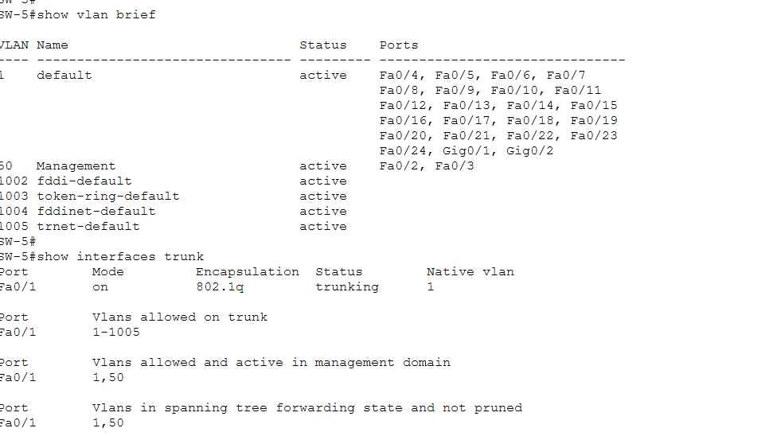

### RSTP Root Bridge Confirmation
`show spanning-tree vlan X` confirms the central switch is root for every VLAN, with all ports in Designated/Forwarding state (no blocking — expected, since this is a loop-free star topology):
- 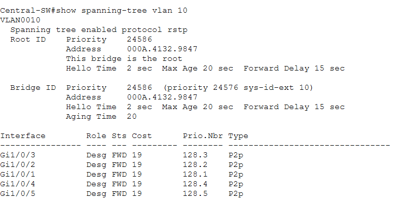
- 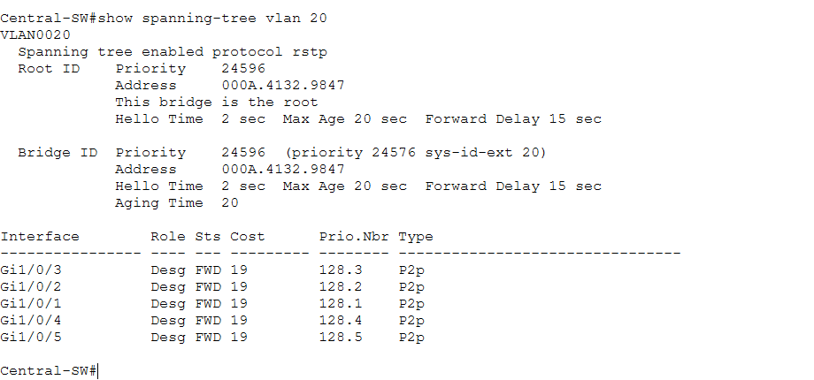
- 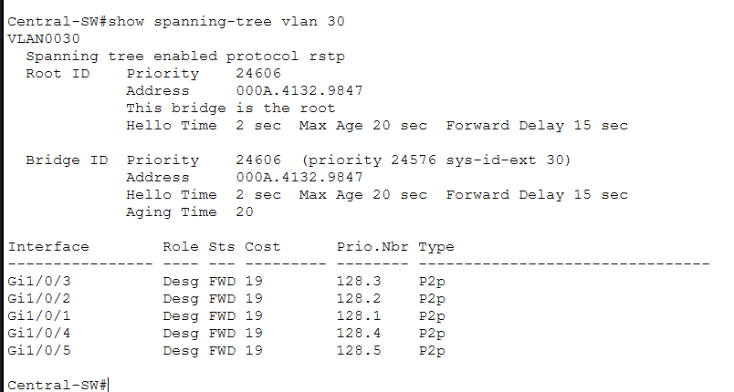
- 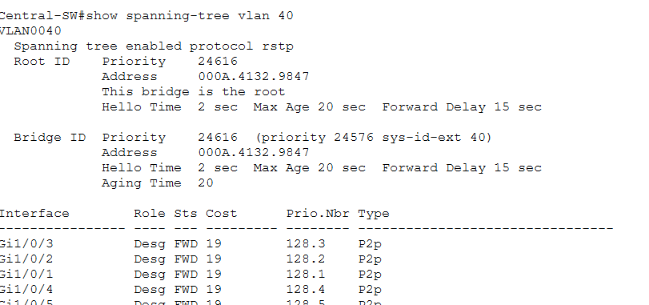
- 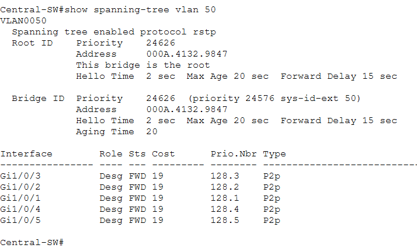

### SVI and Routing Table
`show ip interface brief` confirms all five SVIs are up/up with correct IP addressing:
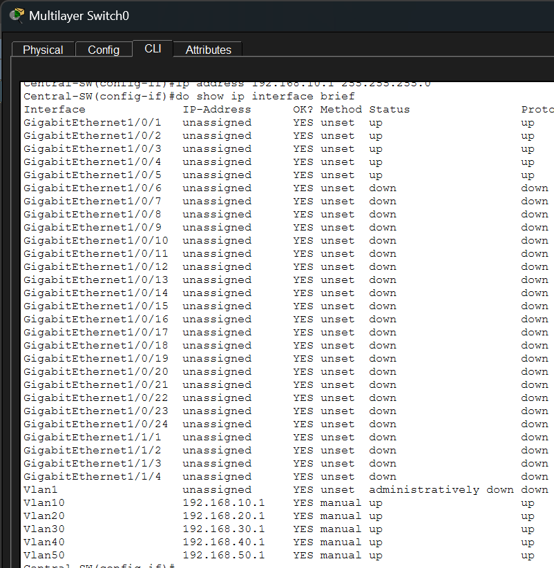

`show ip route` confirms all five subnets are directly connected and available for routing:

### End-to-End Cross-VLAN Connectivity
Successful pings between PCs in different VLANs confirm inter-VLAN routing is functioning correctly. TTL=127 (rather than the default 128) on each reply confirms the packet crossed exactly one Layer 3 hop — the central switch's routing engine:
- 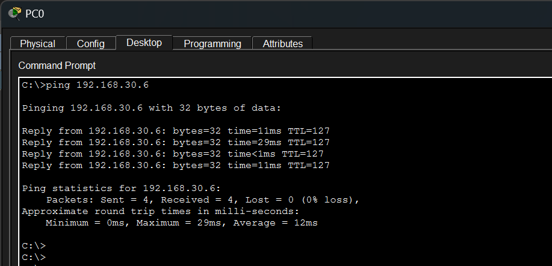 — PC0 (HR, VLAN10) → 192.168.30.6 (Sales, VLAN30)
- 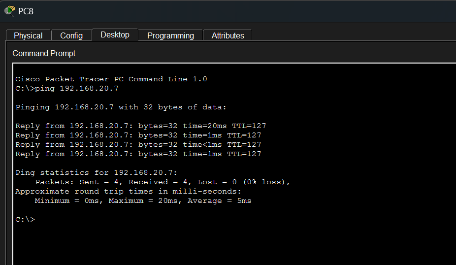 — PC8 (Management, VLAN50) → 192.168.20.7 (IT, VLAN20)

## Key Troubleshooting Notes

- **RSTP transient states**: `show spanning-tree` occasionally displayed a port in an inconsistent Alternate/Forwarding state immediately after root bridge reconfiguration. This resolved after a reload, confirming it was a simulation display artifact during convergence rather than an actual topology loop (verified via `show cdp neighbors` showing exactly one neighbor per access switch, with no duplicate links).
- **Inter-VLAN routing not working despite SVIs being up/up**: the root cause was `ip routing` not being enabled globally on the multilayer switch. SVIs can show `up/up` individually without the switch actually performing Layer 3 forwarding between them — `ip routing` must be explicitly enabled on Cisco multilayer switches (unlike dedicated routers, where routing is on by default).

## Tools Used

- Cisco Packet Tracer

## Author
Ibraheem

## License
This project is open for academic and learning purposes. Feel free to reference or reuse it for your studies.
